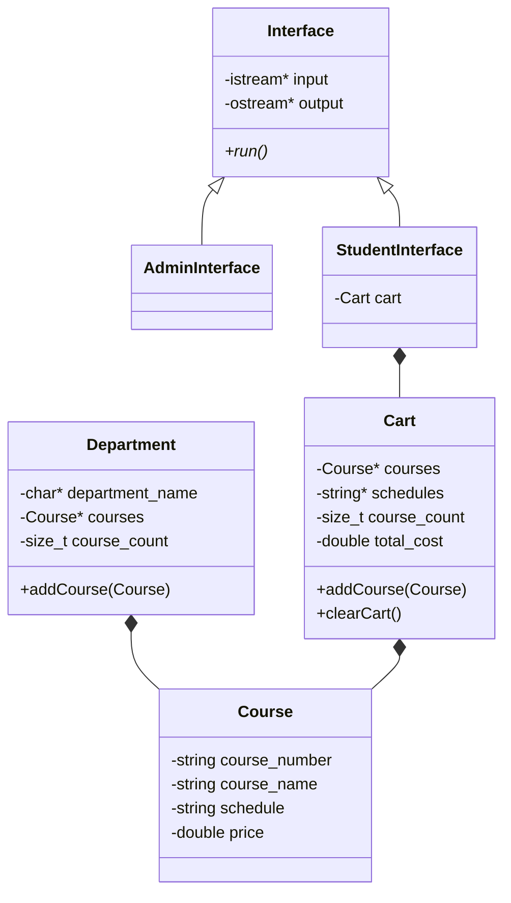

# Course Management System
A console-based C++ application for managing departments and courses and for
allowing students to browse available courses, build a cart, and check out.
The project demonstrates encapsulation, inheritance, runtime polymorphism,
dynamic memory management, deep copying, file persistence, input validation,
and automated testing.
## Features
Student interface
Browse all available departments.
View the courses offered by a selected department.
Add courses to a shopping cart.
View or clear the cart.
Display the cart total with 13% tax.
Check out and clear the purchased courses.
Admin interface
List all departments.
Add departments to the dynamically allocated department array.
Add courses to any existing department.
Validate course numbers, names, schedules, and prices.
Save all department and course changes to `courses.csv`.
Data persistence
Loads department and course data from CSV when the program starts.
Starts with an empty store when the CSV file does not exist.
Validates CSV records before replacing the current in-memory data.
Preserves existing data if loading fails.
Writes prices with two decimal places.
## Requirements
CMake 3.20 or newer
A compiler supporting C++17, C++20, or C++23
Git and an internet connection during the first test configuration so CMake
can download GoogleTest
The project has been designed to compile with GCC, Clang, and Apple Clang.
## Build
From the repository root, configure the project with the desired C++ standard:
```bash
cmake -S . -B build -DPROJECT_CXX_STANDARD=17
```
Valid values are `17`, `20`, and `23`. The default is C++23.
Build the application and test executable:
```bash
cmake --build build --parallel
```
## Run
On Linux or macOS:
```bash
./build/course_management_system
```
On Windows, the executable may be located at one of the following paths,
depending on the selected CMake generator:
```powershell
.\build\course_management_system.exe
.\build\Debug\course_management_system.exe
```
Run the program from the repository root so the relative path `courses.csv`
refers to the CSV file stored beside the source files.
Using the application
## Role selection
The program loads `courses.csv` and then displays:
```text
===== Course Management System =====
1. Student
2. Admin
Enter your choice [1, 2]:
```
The prompt repeats until a valid selection is entered. The selected derived
interface is created through an `Interface*`, and `run()` is dispatched using
runtime polymorphism.
### Student menu
```text
===== Student Menu =====
1. View cart
2. Browse departments to add courses
3. Exit
```
To purchase a course:
Select Browse departments to add courses.
Enter the displayed number of a department.
Enter the displayed number of a course.
Enter `0` when finished browsing that department.
Return to the student menu and select View cart.
Select Checkout to complete the purchase.
The cart is stored only in memory. Checkout clears the cart and does not modify
the CSV course catalogue.
### Admin menu
```text
===== Admin Menu =====
1. List departments
2. Add department
3. Add course to department
4. Save changes
5. Exit
```
Admin changes remain in memory until Save changes is selected. Exiting
without saving does not write newly added departments or courses to the CSV
file.
### Valid course schedules are:
`M/W`
`T/R`
`W/F`
Course prices must be positive numbers. Department names, course numbers, and
course names cannot be empty or contain commas because commas delimit CSV
fields.
## CSV file format
The first line contains the total number of departments. Each department record
contains its name and course count, followed by that many course records.
```text
<department count>
<department name>,<course count>
<course number>,<course name>,<schedule>,<price>
```
### Example:
```csv
2
Programming,2
PRG210,Programming Using C++,M/W,550.00
OOP244,Introduction to Object-Oriented Programming,T/R,575.00
Networking,1
NTF201,Networking Fundamentals,W/F,525.00
```
The current CSV implementation does not support quoted fields, so names cannot
contain commas.
## Architecture

## Class responsibilities
`Course`	Stores a course number, name, schedule, and price.
`Department`	Owns a department name and a dynamic array of courses.
`Cart`	Owns selected courses and schedules and calculates the total with 13% tax.
`Interface`	Defines the polymorphic `run()` contract and shared validation and display functions.
`AdminInterface`	Implements department and course management and CSV saving.
`StudentInterface`	Implements department browsing, cart management, and checkout.
`CSVUtils`	Loads and saves the global department store using CSV files.
`main.cpp`	Owns the global store, selects a role, runs the selected interface, and performs final cleanup.

## Object-oriented design
### Encapsulation
All class data members are private. State is accessed or modified through
public member functions.
### Inheritance and polymorphism
`AdminInterface` and `StudentInterface` derive from the abstract `Interface`
base class. `main.cpp` stores the selected object in an `Interface*` and calls
the overridden `run()` function. The base destructor is virtual so deleting the
object through the base pointer is safe.
### Dynamic arrays and deep copying
`Department` and `Cart` own dynamically allocated arrays. Both implement a
destructor, copy constructor, and overloaded assignment operator so copies own
independent memory. This is the Rule of Three.
When an item is added, the class:
Allocates an array with one additional element.
Copies the existing elements.
Adds the new element.
Deletes the old array.
Stores the expanded array and updates its count.
### Ownership
`main.cpp` owns and deletes the global `StoreDepartments` array.
Each `Department` owns its department-name character array and course array.
`StudentInterface` owns its `Cart` object.
Each `Cart` owns its course and schedule arrays.
`Interface` refers to input and output streams but does not own or delete
them.
### Input validation
The shared `Interface` class reads complete lines before parsing them. This
prevents failed formatted extraction from leaving invalid characters in the
input stream.

Validation rejects:
Non-numeric or partially numeric menu selections
Choices outside the permitted range
Empty or whitespace-only required text
Commas in CSV-backed text fields
Zero, negative, malformed, or partially numeric prices
Schedules other than `M/W`, `T/R`, and `W/F`
Tests

The GoogleTest suite covers:
`Course` construction and accessors
`Department` dynamic growth, indexed access, deep copying, assignment, and
self-assignment
`Cart` additions, totals with tax, clearing, reuse, and copy semantics
CSV loading, saving, formatting, round trips, malformed input, and failure
safety

Run all registered tests with:
```bash
ctest --test-dir build --output-on-failure
```
Run the GoogleTest executable directly to see individual cases:
```bash
./build/course_management_tests
```
On a multi-configuration Windows generator, use:
```powershell
.\build\Debug\course_management_tests.exe
```

### Project structure
```text
.
├── CMakeLists.txt
├── CSVUtils.cpp
├── CSVUtils.h
├── admin_interface.cpp
├── admin_interface.h
├── cart.cpp
├── cart.h
├── course.cpp
├── course.h
├── courses.csv
├── department.cpp
├── department.h
├── interface.cpp
├── interface.h
├── main.cpp
├── student_interface.cpp
├── student_interface.h
└── tests/
    ├── cart_tests.cpp
    ├── course_tests.cpp
    ├── csv_utils_tests.cpp
    └── department_tests.cpp
```

## Troubleshooting
The program reports that the CSV file was not found
Run the executable from the repository root or ensure `courses.csv` exists in
the process's working directory.
CMake does not recognize a source-file change
Reconfigure and rebuild:
```bash
cmake -S . -B build
cmake --build build --parallel
```
GoogleTest cannot be downloaded
The first configuration uses CMake `FetchContent` to download GoogleTest.
Confirm that Git and an internet connection are available, then configure the
project again.
